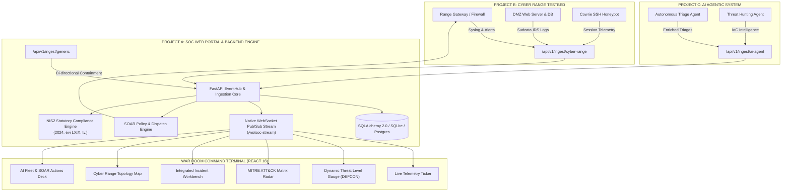

# 🛡️ Óbuda Cyber Operations // SOC-80 Mainframe Command Web Portal

[](https://opensource.org/licenses/MIT)
[](https://fastapi.tiangolo.com/)
[](https://react.dev/)
[](#-nis2-statutory-compliance-engine)
[](https://attack.mitre.org/)
[](#-user-experience--visual-design)

> **Óbudai Egyetem • Bánki Donát Gépész- és Biztonságtechnikai Kar**  
> **Biztonságtudományi és Kibervédelmi Intézet (BKI)**  
> **Tantárgyi Vezetés:** Dr. habil. Rajnai Zoltán DSc. egyetemi tanár

---

## 📖 Executive Summary

The **Óbuda Cyber Operations Mainframe (SOC-80)** is a high-density, real-time Security Operations Center Command Web Portal built for academic research, live cyber range telemetry ingestion, AI-driven threat triage, and European NIS2 statutory incident compliance.

Engineered with an **80s Retro-Cyberpunk CRT aesthetic** (amber/green phosphor typography, scanline emulation, monospaced HUD), the platform operates as the central hub of a **Tripartite Project Fusion Architecture**, seamlessly bridging:
- **Project A:** Central SOC Web Portal & Command Center (Ingestion listeners, Master-Detail Workbench, SOAR & Compliance).
- **Project B:** Cyber Range Simulation Testbed (Multi-node virtual network, Suricata IDS, decoy honeypots, traffic generators).
- **Project C:** Autonomous AI Agent Fleet (LLM-based alert triaging, automated risk scoring, Human-in-the-Loop SOAR playbooks).

---

## 🏛️ Tripartite Fusion Architecture



---

## ✨ Core System Capabilities

### 1. 🖥️ War Room Operations & KPI Dashboard
- **Dynamic Threat Index (DEFCON Matrix):** Real-time severity score calculated from active incident count, unmitigated attack vectors, and target criticality.
- **MITRE ATT&CK Tactical Radar:** Dynamic 6-tactic matrix (*Initial Access, Execution, Persistence, Lateral Movement, Exfiltration, Impact*) with live hit counters and pulsating breach indicators.
- **Real-Time Telemetry Ticker:** Sub-second packet and log streaming from open listeners (`/api/v1/ingest/*`) with buffer control and status indicators.
- **MTTD / MTTR Real-Time SLA Counters:** Continuous monitoring of Mean Time to Detect (< 15 min SLA) and Mean Time to Respond (< 60 min SLA).

### 2. ⚡ Cyber Range Attack Simulation Deck
- Embedded on-page attack controller supporting 4 standardized threat scenarios:
  1. **SSH Brute-Force + CVE-2024-38077 Root Privilege Escalation** (Suricata IDS detection, payload analysis, UID 0 spawn).
  2. **SQL Injection Data Exfiltration** (WAF bypass detection, UNION SELECT pattern match, DB extraction).
  3. **Cowrie Honeypot Decoy Engagement** (Automated botnet crawler interaction, attacker command logging).
  4. **LockBit 3.0 Ransomware Emulation** (SMB lateral spread, volume shadow copy deletion, critical asset isolation).
- **Instant System Reset:** One-click rollback that restores baseline topology and re-seeds clean incident states without restarting the backend.

### 3. 🔍 Integrated Master-Detail Incident Workbench
- **Single-Page High-Density Layout:** Eliminates disorienting pop-up windows; all incident details, alerts, and investigations load directly into the split-pane on-page workbench.
- **Comprehensive Sub-Tab Navigation:**
  - `Overview`: Threat classification, MITRE technique metadata, severity badges, and status transition machine (`new` ➔ `triaged` ➔ `investigating` ➔ `contained` ➔ `resolved`).
  - `Alert Telemetry`: Raw Suricata and system audit packet payloads with JSON formatting.
  - `IoCs & Threat Intel`: Observable tracking (IP, SHA256, URL, Domain) with reputation scoring and contextual analyst notes.
  - `AI Triages`: Autonomous LLM incident explanations, confidence scores, and mitigation advice.
  - `SOAR Action Log`: Execution audit trail and bi-directional response status.
  - `NIS2 CSIRT Dossier`: Instant regulatory classification and statutory reporting status.

### 4. 🤖 AI Fleet & Human-In-The-Loop (HITL) SOAR Engine
- **Autonomous Triaging:** Ingests raw alerts from Project C AI models, correlates root causes, and assigns algorithmic threat scores (0–100).
- **Dual-Mode SOAR Playbooks:**
  - *Automated Execution:* Low-risk containment actions (e.g. drop malicious scanning IP at firewall).
  - *HITL Manual Approval:* High-impact actions (e.g. isolate production web server VLAN, revoke domain controller credentials) require explicit human analyst authorization.
- **Bi-Directional Dispatcher (`/api/v1/dispatch/execute`):** Dispatches containment commands back to the Cyber Range testbed.

### 5. 🛡️ NIS2 Statutory Compliance Engine
- Built according to **Hungary's 2024. évi LXIX. törvény a kiberbiztonságról** and **EU Directive 2022/2555 (NIS2)**.
- **Automated 24-Hour Early Warning Dossier (18. §):** Generates official CSIRT alert payload within statutory deadlines.
- **Automated 72-Hour Incident Notification Dossier (19. §):** Generates full impact assessments, mitigation timelines, and IoC logs.
- **1-Click Official JSON Dossier Export:** Instant clipboard copy ready for national authority submission.

### 6. 🌐 Bilingual Operations (HU 🇭🇺 / EN 🇬🇧)
- Full system-wide instant language toggle with persistent client-side storage.
- All dashboard metrics, alert categories, simulator vectors, incident fields, and compliance templates dynamically translate without page reload.

---

## 🛠️ Technical Stack & Dependencies

| Layer | Technologies |
| :--- | :--- |
| **Backend Engine** | **FastAPI**, Python 3.12, Uvicorn, Pydantic v2 |
| **Persistence & ORM** | **SQLAlchemy 2.0 (Async)**, SQLite / PostgreSQL |
| **Real-Time Communication** | **Native WebSockets**, EventHub Pub/Sub Engine |
| **Frontend Architecture** | **React 18**, Vite 5, React Context API |
| **Styling & HUD Design** | **Tailwind CSS**, Custom 80s CRT Phosphor Scanline Shaders |
| **Icons & Visuals** | **Lucide React**, Google Fonts (*VT323, Chakra Petch, Share Tech Mono*) |
| **Deployment Options** | Windows Batch Scripts, Docker / Uvicorn, **GitHub Pages Static Showcase** |

---

## 📡 REST API & Ingestion Specification

The backend provides complete OpenAPI 3.0 / Swagger documentation at `http://localhost:8000/docs`.

### Key Integration Endpoints

```http
### 1. Cyber Range Telemetry Ingestion (Project B -> Project A)
POST /api/v1/ingest/cyber-range
Content-Type: application/json

{
  "source_node": "range-gw-01",
  "alert_type": "SURICATA_IDS",
  "signature": "ET SCAN Potential SSH Scan",
  "severity": "HIGH",
  "source_ip": "194.26.29.114",
  "dest_ip": "10.0.10.15",
  "dest_port": 22,
  "protocol": "TCP",
  "raw_payload": "{\"attempts\": 142}"
}

### 2. AI Agent Triage Ingestion (Project C -> Project A)
POST /api/v1/ingest/ai-agent
Content-Type: application/json

{
  "incident_id": 1,
  "agent_name": "Agent-Sentinel-Triager",
  "model_version": "Gemini-1.5-Pro-SecOps",
  "threat_score": 95,
  "confidence": 0.94,
  "summary": "Compromised SSH credentials followed by privilege escalation.",
  "recommended_actions": ["Isolate host", "Block IP on firewall"]
}

### 3. Outbound SOAR Command Dispatch (Project A -> Project B)
POST /api/v1/dispatch/execute
Content-Type: application/json

{
  "target_node": "range-gw-01",
  "command": "iptables -A INPUT -s 194.26.29.114 -j DROP",
  "action_type": "BLOCK_IP_FIREWALL"
}

### 4. Real-Time Telemetry WebSocket
WS ws://localhost:8000/ws/soc-stream
```

---

## 🚀 Quickstart & Local Installation

### Prerequisites
- **Python 3.10+** (FastAPI, Uvicorn, SQLAlchemy)
- **Node.js 18+ & npm** (Vite, React 18)

---

### Method A: 1-Click Startup (Windows)
Double-click `start_all.bat` or run:
```cmd
start_all.bat
```
*(Automatically launches the FastAPI backend on port 8000 and the Vite frontend on port 5173).*

---

### Method B: Manual Startup

#### 1. Start the Backend API
```bash
cd soc-portal/backend
python -m pip install -r requirements.txt
python -m uvicorn app.main:app --host 127.0.0.1 --port 8000 --reload
```
- API Dashboard: `http://localhost:8000`
- Swagger Interactive Docs: `http://localhost:8000/docs`
- WebSocket Live Feed: `ws://localhost:8000/ws/soc-stream`

#### 2. Start the Frontend Application
```bash
cd soc-portal/frontend
npm install
npm run dev
```
- Open browser at: `http://localhost:5173`

---

## 🌐 Deploying to GitHub Pages (Static Showcase)

A standalone, pre-built static package is provided in the [`soc-portal-gh-pages/`](./soc-portal-gh-pages/) directory.

1. Create a new GitHub repository.
2. Upload the contents of `soc-portal-gh-pages/` to the repository root.
3. In GitHub: **Settings ➔ Pages ➔ Source: Deploy from branch ➔ main / root**.
4. The site will deploy instantly with **Offline In-Browser Simulation Mode** enabled, allowing full interactivity without needing a live backend!

---

## 👥 Academic Credits & Contributor Directory

In accordance with course guidelines, the complete, interactive team roster containing all **Student Developers, Neptune IDs, and Role Badges** (Head of SOC, Threat Intelligence, Infrastructure, GRC & Compliance, AI & Web Portals) is accessible directly inside the running application:

👉 **Navigate to:** `TOPNAV ➔ CREDITS // MANIFEST`  
*(Includes dynamic search by name, Neptune ID filter, and color-coded specialization badges).*

---

## ⚖️ License & Accreditation
- Developed for **Óbudai Egyetem (Óbuda University) — Bánki Donát Gépész- és Biztonságtechnikai Kar**.
- Licensed under the [MIT License](LICENSE).
