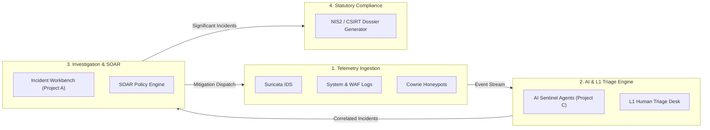
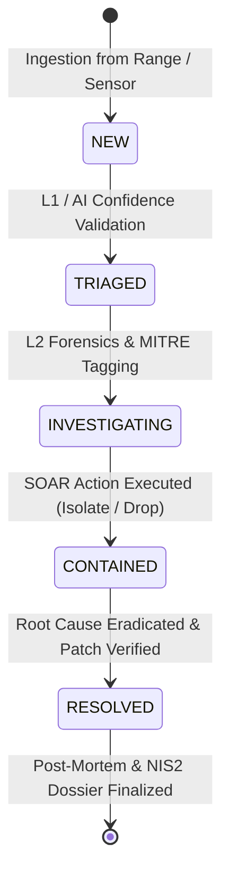

# 🛡️ Security Operations Center (SOC) Operational Manual & Architectural Specification

**Óbudai Egyetem • Bánki Donát Gépész- és Biztonságtechnikai Kar**  
**Biztonságtudományi és Kibervédelmi Intézet (BKI)**  
**Tantárgyi és Szakmai Vezetés:** Dr. habil. Rajnai Zoltán DSc. egyetemi tanár  
**Hivatkozott Jogszabály:** 2024. évi LXIX. törvény a kiberbiztonságról (NIS2) & 2024. évi LXXXIV. törvény (CER)

---

## 📋 1. SOC Mission, Scope & Governance

### 1.1 Objective
The primary mission of the **Óbuda Cyber Operations Mainframe (SOC-80)** is to ensure 24/7/365 visibility, real-time threat detection, rapid containment, cyber resilience, and regulatory compliance across monitored critical infrastructure and simulated Cyber Range environments.

### 1.2 Tripartite Fusion Concept
The SOC functions as the central command orchestrator integrating three interdependent subsystems:
1. **Command & Ingestion Web Portal (Project A):** Real-time War Room HUD, Master-Detail investigation workbench, bidirectional SOAR dispatchers, and statutory reporting engine.
2. **Cyber Range Testbed (Project B):** Multi-tier virtualized infrastructure, Suricata IDS sensors, Cowrie honeypots, and traffic generators.
3. **AI Agentic Fleet (Project C):** Autonomous multi-agent LLM systems providing Level-0 alert pre-filtering, algorithmic threat scoring, and automated mitigation recommendations.



---

## 👥 2. SOC Organizational Hierarchy & Tier Responsibilities

The SOC organizational model follows the international standard 4-Tier hierarchical structure:

| Tier / Role | Focus Area | Core Responsibilities | Target SLA |
| :--- | :--- | :--- | :--- |
| **Tier 1 (L1) Analyst** | *Alert Triage & Initial Response* | Continuous queue monitoring, alert validation, false positive suppression, initial IOC tagging, escalation to L2. | **MTTD < 15 min** |
| **Tier 2 (L2) Responder** | *Deep Investigation & Threat Hunting* | Root cause analysis, memory/disk/network forensics, MITRE ATT&CK mapping, SOAR playbook execution, malware triaging. | **MTTR < 60 min** |
| **Tier 3 (L3) / SecOps** | *Engineering & Threat Intelligence* | Custom Suricata rule development, SOAR playbook automation, Cyber Range scenario design, adversary emulation. | Continuous |
| **Head of SOC / Manager** | *Governance & Incident Command* | Incident Commander for CRITICAL/HIGH breaches, statutory CSIRT reporting authorization, resource allocation. | Immediate on Critical |
| **GRC & Compliance Lead** | *Statutory & Audit Oversight* | NIS2 compliance auditing (2024. évi LXIX. tv.), audit trail integrity, statutory documentation preservation. | Within 24h/72h |

---

## ⏱️ 3. Operational Metrics & Service Level Agreements (SLAs)

### 3.1 Mean Time to Detect (MTTD)
$$\text{MTTD} = \frac{\sum (\text{Detection Timestamp} - \text{Initial Breach Timestamp})}{\text{Total Confirmed Incidents}}$$
- **Operational Target:** $< 15.0 \text{ minutes}$
- **Enforcement:** Real-time visual threshold gauge in the War Room header. Breaches trigger amber/red DEFCON escalations.

### 3.2 Mean Time to Respond & Contain (MTTR)
$$\text{MTTR} = \frac{\sum (\text{Containment Timestamp} - \text{Triage Confirmation Timestamp})}{\text{Total Resolved Incidents}}$$
- **Operational Target:** $< 60.0 \text{ minutes}$
- **Enforcement:** Tracked per incident lifecycle in the database audit log.

### 3.3 Alert Fatigue Mitigation Index
- **Challenge:** High-volume raw IDS and syslog feeds produce thousands of events daily, causing analyst desensitization.
- **SOC-80 Solution:**
  1. *Rule-Based De-duplication:* Aggregates bursts of identical signatures from the same source IP into single incident threads.
  2. *AI Pre-Triaging (Project C):* Autonomous agents score confidence (0.00–1.00) and severity (0–100), pre-populating summaries and IoC lists.
  3. *Single-Pane Workbench:* Eliminates tab/popup clutter by integrating all context into an on-page split-pane workbench.

---

## 🔄 4. Standard Incident Handling Lifecycle (SOP-01)



### Phase 1: Detection & Ingestion
- Sensors across the Cyber Range (Suricata IDS, pfSense firewall, Cowrie honeypots, Linux PAM) emit telemetry to `/api/v1/ingest/*`.
- Backend EventHub validates Pydantic schemas, inserts records into the database, and broadcasts updates via WebSocket (`/ws/soc-stream`).

### Phase 2: Triage & Correlation
- Incidents are evaluated against the MITRE ATT&CK framework.
- Severity levels are assigned:
  - 🔴 **CRITICAL:** Active root privilege escalation, ransomware execution, Domain Controller compromise.
  - 🟠 **HIGH:** SQL injection data exfiltration, lateral movement attempts.
  - 🟡 **MEDIUM:** High-rate port scans, unauthorized credential probing, honeypot hits.
  - 🟢 **LOW:** Informational alerts, baseline policy anomalies.

### Phase 3: Investigation & Forensic Enrichment
- Analysts inspect the **Alert Telemetry Sub-Tab** for raw packet payloads.
- Observable Indicators of Compromise (IoCs) are logged (IP addresses, SHA-256 file hashes, malicious URLs, target ports) with reputation classifications (*malicious, suspicious, benign*).

### Phase 4: Containment & SOAR Orchestration
- Mitigations are executed via the SOAR engine:
  - **Automated:** Low-risk defensive rules (e.g. drop scanning IP at perimeter gateway).
  - **Human-in-the-Loop (HITL):** High-impact containment (e.g. isolate production server VLAN, revoke domain controller kerberos tickets) requires explicit analyst click authorization.
- Commands are dispatched to target range nodes via `/api/v1/dispatch/execute`.

### Phase 5: NIS2 Statutory Compliance & Post-Mortem
- For significant incidents, statutory dossiers are compiled and exported:
  - **24-Hour Early Warning (18. §)**
  - **72-Hour Comprehensive Incident Notification (19. §)**
- Incidents transition to `resolved` once remediation is verified.

---

## 🎯 5. Standardized Attack Scenarios & Response Playbooks

### Playbook PB-01: SSH Brute-Force & CVE Privilege Escalation
- **Threat Vector:** Automated dictionary scan followed by local exploit execution (e.g. CVE-2024-38077).
- **MITRE Tactic:** Initial Access (`T1110.001`) ➔ Privilege Escalation (`T1068`).
- **SOAR Response:**
  1. Automated: Add attacker source IP to firewall drop table (`range-gw-01`).
  2. HITL: Isolate affected host network interface via OpenFlow VLAN change.
  3. Remediation: Invalidate active PAM sessions and rotate SSH authorized keys.

### Playbook PB-02: Web Application SQL Injection (SQLi)
- **Threat Vector:** Injected UNION SELECT strings in public endpoints extracting database tables.
- **MITRE Tactic:** Initial Access (`T1190`) ➔ Exfiltration (`T1048`).
- **SOAR Response:**
  1. Automated: Deploy WAF rule signature drop.
  2. Investigation: Check PostgreSQL query audit logs for leaked table columns.
  3. Remediation: Deploy parameterized input validation patch.

### Playbook PB-03: Cowrie Honeypot Decoy Engagement
- **Threat Vector:** Unauthorized threat actor accessing decoy SSH service.
- **MITRE Tactic:** Credential Access (`T1059.004`).
- **SOAR Response:**
  1. Passive: Log attacker IP, keystrokes, downloaded payload binaries.
  2. Threat Intel: Extract payload SHA-256 and submit to threat intelligence feed.

### Playbook PB-04: LockBit 3.0 Ransomware & SMB Lateral Spread
- **Threat Vector:** Rapid enumeration of SMB IPC$ shares, volume shadow copy deletion (`vssadmin delete shadows`).
- **MITRE Tactic:** Lateral Movement (`T1021.002`) ➔ Impact (`T1486`).
- **SOAR Response:**
  1. HITL (Immediate): Emergency network isolation of Domain Controller and file shares.
  2. Remediation: Terminate malicious process tree, restore snapshot backups from immutable storage.

---

## ⚖️ 6. NIS2 & Statutory Compliance Architecture

The SOC platform embeds compliance controls matching Hungarian national cybersecurity legislation (**2024. évi LXIX. tv.**) and EU Directive 2022/2555:

```
[Incident Occurs]
       │
       ├── Is Significant Incident? (Severity CRITICAL/HIGH or Critical Asset)
       │         │
       │         ├── YES ➔ Trigger NIS2 Statutory Workflow
       │         │         ├── T + 24 Hours: Generate 24h Early Warning Dossier (18. §)
       │         │         │                 • CSIRT Incident ID
       │         │         │                 • Suspected Cause & Attack Vector
       │         │         │                 • Cross-Border / EU Impact Assessment
       │         │         │
       │         │         └── T + 72 Hours: Generate 72h Comprehensive Incident Report (19. §)
       │         │                           • Detailed Technical Root Cause
       │         │                           • IoC Observable Dossier
       │         │                           • Applied SOAR Mitigations & Recovery SLA
       │         │
       │         └── NO  ➔ Standard Internal SOC Documentation
```

---

## 🖥️ 7. War Room HUD & Ergonomics Specification

1. **High Information Density:** Maximum operational visibility per square inch without cognitive overload.
2. **Authentic 80s Mainframe CRT Aesthetics:** Amber/cyan phosphor palette, scanline overlays, monospaced typography (*VT323, Chakra Petch, Share Tech Mono*).
3. **Zero Floating Popups:** All inspections, telemetry logs, IoC entries, and compliance reports load inline within the structured Master-Detail workbench.
4. **Bilingual Command Switch:** Full English 🇬🇧 and Hungarian 🇭🇺 localization toggled with a single keystroke/button in the top navigation bar.

---

## 📚 8. Academic References & Regulatory Standards

1. **2024. évi LXIX. törvény a kiberbiztonságról** (Magyar Közlöny, NIS2 átültetés).
2. **2024. évi LXXXIV. törvény** a kritikus szervezetek ellenálló képességéről (CER).
3. **EU Directive 2022/2555 (NIS2)** on measures for a high common level of cybersecurity across the Union.
4. **MITRE ATT&CK Enterprise Matrix v14** (Adversary Tactics, Techniques, and Common Knowledge).
5. **NIST Special Publication 800-61 Rev. 2:** Computer Security Incident Handling Guide.
6. **Dr. habil. Rajnai Zoltán DSc.:** Kiberbiztonsági és SOC Működési Tananyagok, Óbudai Egyetem Bánki Kar.
